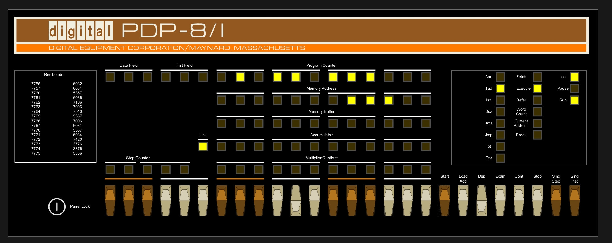
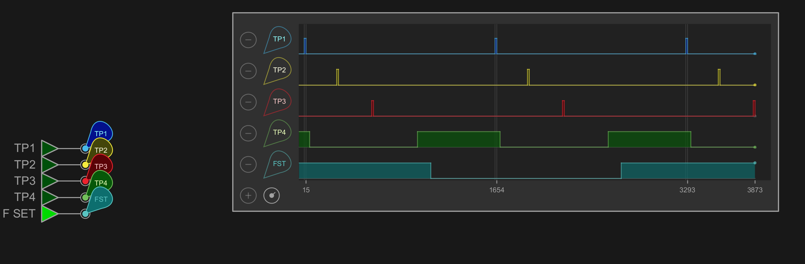
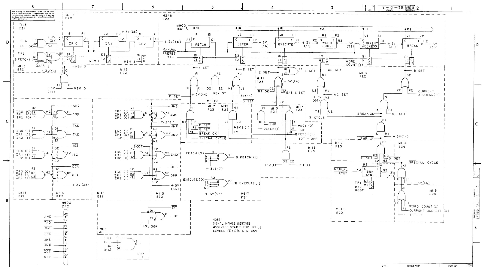
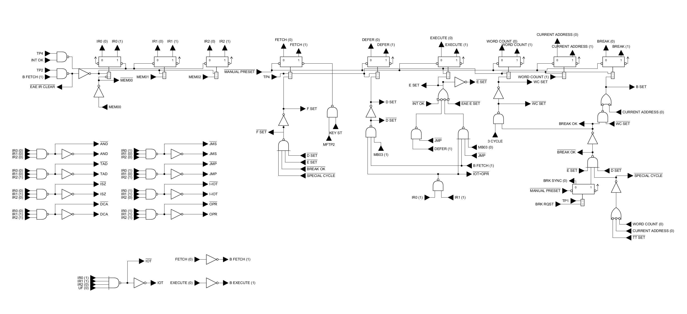

# A PDP-8/I implementation in Antares

This project is a transcription of the PDP-8/I circuit as given in [volume II of the maintenance manual](https://bitsavers.org/pdf/dec/pdp8/pdp8i/DEC-8I-HR2A-D_8Imaint_May70.pdf) into the [Antares](https://www.antarescircuit.io/) digital logic simulator.

# How to use
Clone the repository, open the `antares-workspace` as a workspace in Antares, then open the PDP-8/I project inside that workspace.

There are some example programs in the `programs` directory that can be imported into the emulated core memory.

Antares allows connecting a virtual oscilloscope to any signal, simply create a global tunnel with the original name of the signal and connect a scope in real-time mode as shown below.

# General PDP-8 Information
Short introduction coming soon.

# Why?

I'm interested in the PDP-8/I because Oscar Vermeulen built an [awesome replica](https://obsolescence.wixsite.com/obsolescence/pidp-8) of the front panel. But that replica uses a Raspberry Pi running [SIMH](https://github.com/open-simh/), an emulator whose PDP-8 implementation is mainly based on anecdotal behavior rather than the real schematic. Also, SIMH emulates a PDP-8/E instead of an 8/I, so the behavior doesn't quite match what the front panel
suggests. For example, single stepping doesn't work and some lamps are never turned on.

There are also some FPGA implementations of the 8/I, but they are based on observations and anecdotes as well. Since the full original schematics of the entire machine are given its maintenance manual and even explained in [volume I](https://bitsavers.org/pdf/dec/pdp8/pdp8i/DEC-8I-HR1A-D_8Imaint_Mar70.pdf) of that manual, I had the idea to create an FPGA implementation of the original circuit rather than another anecdotal emulator.

That project is called [SoCDP-8](https://github.com/fpw/SoCDP8) and nearly finished. There's also a browser version of it on [pdp8.app](https://pdp8.app).

However, converting an asynchronous circuit that uses delay lines and core memory to a modern FPGA with synchronized logic can introduce subtle errors, even more so in the software conversion of that logic that runs in the browser version.

This inspired the idea to transcribe the original circuit without any changes into a digital logic simulator where corner cases can be studied and signals can be compared to the FPGA version. It could also help owners of a real 8/I to diagnose malfunctions in their system since the behavior should exactly match that of an original machine.

That is, to go from something like this original schematic

to this schematic in Antares

